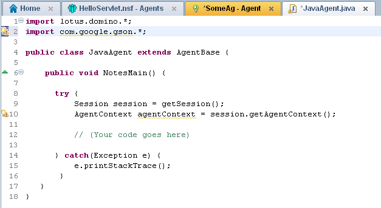

[Edit]

[In the comments, Sven Petri pointed out](/xpages/a-quick-note-on-JARs/#comment-1872739749) the need to have the JAR in the same relative path in the Designer environment conducting any build of the NSF. This is absolutely worth noting, though my excitement on this topic was driven by the lack of need to edit the `java.policy` ([a `java.pol` file is preferable](https://oliverbusse.notesx.net/hp.nsf/blogpost.xsp?documentId=EAA)) file. Ultimately, everyone ought to communicate with their customers and/or administrators as to the external dependencies, to avoid any build issues by customer admins or non-developers. Basically, make sure people know to drop a copy of the JARs from the server in their local `/jvm/lib/ext/` path.

[/Edit]

### Preface

Either I just didn't know that this was a viable option or we've all been living in the dark for too long. My suspicion is the former, but what follows is a quick run down of my preferred approach for using the `com.google.gson` library (or any JAR), server-wide (without OSGi deployment). TLDR; drop it in `<install>/jvm/lib/ext/` and restart your Domino server (don't forget to do it with your local/dev environment as well).

### What?

While preparing for my impending blog series on servlets, I've been hammering out a couple of details regarding external dependencies (aka- JAR files). The short story is that I assumed things had to be a certain way (including the `java.policy` edit for granting all permissions), but that wasn't the case. If you want to read the full circle of comments, [go check them out](https://disqus.com/home/discussion/em-devblog/building_java_objects_from_json_93/#comment-1813504147).

### Why?

It seems that setting up what I regard as server elements, even these add-on ones, is something I don't do every day. Any developer can see quickly that re-importing the same JAR file you use across your application instances can become quite tedious, quickly. But it would seem that there is a better way of doing things than just importing your JAR to each NSF and needing to add a line on the server (in `<install>/jvm/lib/security/java.policy`) of

```
grant { permission java.security.AllPermission; }
```

To rule out what I have going in my primarily development environment (something that doesn't come up for me as a staff employee of an IBM customer, as my environment doesn't change, unless I add a picture of my kid to my desk), I created a fresh install of Notes/Domino Designer. I took a look at the `<install>/jvm/lib/security/java.policy` file and noticed something that works to our advantage as developers.


So, without the need to edit the java.policy file, this makes things a much easier sell to your admins (even though I recommend just buying them their beverage of choice 🍺), as adding an industry accepted library to your server stack has a whole different tone than potentially scaring them with words like "grant" and "java.security.AllPermission". One still needs access to the file system, so it may not do some people a lot of good; which is why, going forward with this series, I'll be making the effort to give every GSON specific task I perform a fair shake with the equivalent using the _com.ibm.commons.util.io.json_ package.

### See It In Action

Here's my import from my series demo code imported into my fresh DDE install via my Git repo. As expected, without any JAR to find, it's going to fail.


Having shut down Designer and placing the `com.google.gson` JAR into the `<install>/jvm/lib/ext/` path and then starting it back up again, you can see that it's now resolved. All without touching the java.policy file.


##### Added Benefit

The plus side to this approach is that it's now also available in Java agents.



### Caveat

As is inevitable with such things, there is a caveat to the use of the `<install>/jvm/lib/ext/` path for JAR inclusion, primarily revolving around any libraries which are already a part of Domino.



Ultimately, I'm aiming to get into OSGi plugins for a first go by including my hit list of usual JAR files, so I can import them on a per-project basis. For example, if I'm building out a RESTful end point with GSON, I'm also probably using a couple Apache Commons libraries. It makes sense to package accordingly. One day, I'll have all the cool toys.
