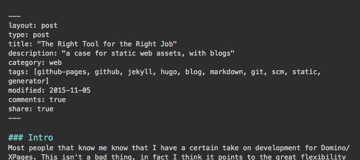

### Before We Get Started

I'm currently following along with [Jesse Gallagher](https://frostillic.us/)'s "That Java Thing" series, as I'm hoping it demystifies the process of creating an OSGi plug-in for me, and I highly recommend any XPages developer out there follow along as well. Jesse is approaching things from a pretty good stand point and I'm sure it'll be worth the ride.

Also, I've gotten my email from IBM confirming the selection of my application development session for IBM Connect 2016 🎉! I'll have more news on that in the near future and I sincerely hope it'll have something for everyone; you'll certainly notice several themes I've been blogging and talking about over the last year and change. So, with any luck, I'll see you in Orlando.

### Intro
Most people that know me know that I have a certain take on development for Domino/XPages. This isn't a bad thing, in fact I think it points to the great flexibility of the XPages runtime with which I spend most of my day job working.

If there's an over-arching theme here that ties back to my usual topics of development, both with or without XPages, it's that pre-processing and generating optimized static (non-runtime generated) assets has great value and can provide a considerable boost to site performance. I've talked about using PageSpeed, Nginx as a reverse proxy, and static asset concatenation and minification before in my MWLUG session and for those that missed it, it will be covered in my up-coming Notes in 9 highlighting that session's material.

### Static Site Generation
I'm using a blog as a use case here, but most general content web sites are applicable; especially as a blog is just a collection of web pages. This static site generation I'm referring to is a form of pre-processing content to generate the "destination" content format. Provided the content is how we want it and there's no custom back-end logic (visibility rights, etc.), then it's really a matter of serving content with nothing else to it.

This applies to a great deal and in this case covers the parsing of markdown into its corresponding HTML content, along with the marrying up of HTML partial files to create the full files according to certain rules or configurations; such as building a "post" (HTML file at a given path based on the title and category property) from the universal header and footer HTML partials, with content filled by the parsed Markdown into HTML content. Repeat that process for each Markdown file fitting a certain file name structure (such as _yyyy-MM-dd-&lt;title&gt;.md_) inside a certain directory (e.g.- __posts/_) and suddenly we have the shape of a blog. There are a few more moving parts such as generating the paginated overview for the main page, but otherwise it's all the same sort of rules.

Don't believe me? This blog's posts all come [from the __posts/_ directory's Markdown files in my GitHub repository](https://github.com/edm00se/DevBlog/tree/gh-pages/_posts). When I post this live, I'll commit it to my git repo and then (schedule a) push to the server. That's it; but I'm getting ahead of myself, for more GitHub Pages, a free service provided by GitHub for all open source repositories they host, scroll down another paragraph.

The generation also can/does (depending on your static site generator or pre-processing script and its configuration) rewrite and uglify/minify JS and combine and minify CSS. This sort of an effort as a pre-processing action decreases server load during runtime processing. It also means that a web server that _just_ serves static web assets can perform all the faster for it. If you apply these rules to a well structured web application running on Domino/XPages to the assets from the _NSF/WebContent/_ folder, then you're serving some well optimized client-side assets.

#### Markdown
[Markdown](https://help.github.com/articles/markdown-basics/) is easy to pick up, converts to valid HTML (for a consistent and web friendly rendering, you can even pass through HTML in case you're lost or have something unique) and is used a lot of places, not just on GitHub. It's something that should be added to the tool set, no matter what. For a quick crash course, the [learn x in y minutes markdown](https://learnxinyminutes.com/docs/markdown/) page does a decent job of highlighting the component parts.

Used with a static site generator, Markdown files often have what's called "front matter" which helps to describe the file and provide properties in a consistent format. Here's an example of the front matter for this post for use with my Jekyll / GitHub Pages instance.

#### Jekyll
[Jekyll](https://jekyllrb.com/) is a "...simple, blog-aware, static site generator..." written in [Ruby](https://www.ruby-lang.org/). I had a couple of bad run ins with Ruby a while back, so I'm not always a huge fan, but so long as your dependencies are taken care of, it can be quite powerful. So powerful that GitHub provides a version of Jekyll site processing for free, along with the server handling and disk space for all open source repositories.

Jekyll has been around longer than others (like Hugo) and is generally a mature and stable project. It also has a number of plugins which do things like create emojis from their respective short codes (in my case, [jemoji](https://github.com/jekyll/jemoji)). There are a number of freely available Jekyll themes which are easily forked or cloned on GitHub to make for a starting point for a blog of your own.

For those looking to get started with Jekyll, you'll need to have a working install of ruby >= version 2.0 and install the jekyll gem (gems in ruby are effectively packages). One good way of managing package dependencies is to use [bundler](https://bundler.io/), which in combination with a Gemfile allows you to define dependencies and perform the install via `bundle install`. If you're going this whole route and expect to need to work with more than one version of ruby on your machine, you'll want to use [rbenv](https://github.com/sstephenson/rbenv) to help manage that chaos (each gem you install is installed to the version of ruby you're using).

#### GitHub Pages
[GitHub Pages](https://pages.github.com/) offers one of two things; static site hosting or a [specific implementation of Jekyll](https://help.github.com/articles/using-jekyll-with-pages/) that generates and serves the generated site. It allows [a subset of plugins](https://help.github.com/articles/using-jekyll-with-pages/#keeping-jekyll-up-to-date) and installs as a gem itself. Strictly speaking, a person _can_ set up a GitHub Pages site with Jekyll and not need to install any local dependencies, provided the lack of local preview and total reliance on a live environment is acceptable. GitHub Pages is:

* free
* ubiquitous with all GitHub accounts and repositories
* doesn't have to be anything other than a static site (easily served and, as GitHub reasons, easily hosted)
* can be a simple static site, non-Jekyll
* did I mention free?

My workflow is essentially to write a draft post in Markdown, while not live, I keep it in the __drafts/_ folder, complete writing, commit to my git repository and, when ready, push to the GitHub server to go live. While comopsing a draft, when I save, my local Jekyll task rebuilds my content and loads it, meaning I'm one browser refresh away from seeing immediate changes from my typing.

I can preview my draft (without moving it to __posts/_) by running my local Jekyll instance by `bundle exec jekyll serve --drafts`; this invokes the jekyll command to build and serve the generated content, including the drafts, and is executed inside of the bundler context to ensure dependencies. To just build I use the command `bundle exec jekyll build`.

As I mentioned, GitHub Pages can hold a non-Jekyll based site, making it more approachable for some or those that prefer other static site generators, like Hugo.

#### Hugo
[Hugo](https://gohugo.io/) is a static site generator written in [GoLang](https://golang.org/). It's achieves the same purpose of generating a site according to a given format and even generates the HTML from Markdown. What sets it apart, aside from the implmementation and language, is that in my opinion, the structure is far more easy to follow.

Instead of creating a `Gemfile`, managing a `_config.yml`, and dealing with what can be a foreign file structure and form of maintenance, Hugo endeavored to make the file structure and extensibility (e.g.- via a theme) much more simplistic and easy to follow for those new to it, and the commands involved considerably easier. Hugo installs pretty normally from their release, but on Mac it's most easily installed via [homebrew](https://brew.sh/) with `brew install hugo`.

#### Others
There are others out there. If you're curious and want to take a look, [staticgen.com](https://www.staticgen.com/) attempts to keep track of them all. The ones I've used and found to be of note are the ones I talked about above, with the exception of GitBook, which Jesse Gallagher turned me on to; he uses it as a nice way to consistently generate documentation, whereas I'm using it for a yet-to-be-announced personal project (because I don't keep busy enough as it is 😉).

### Getting Started With Your Own
With any luck, some of you may be inspired to start up your own blog on GitHub Pages. If you're looking to do so, or just dabble, I recommend checking out the following:

* [GitHub's Pages landing page](https://pages.github.com/)
* [GitHub page on using Jekyll with Pages](https://help.github.com/articles/using-jekyll-with-pages/)
* [Jekyll's documentation on deploying to GitHub](https://jekyllrb.com/docs/github-pages/)
* [Jekyll themes](https://www.jekyllthemes.net/)
* [a highly simple, bare-bones Jekyll starter](https://github.com/cnunciato/jekyll-starter) which shows the components involved in a blog with none of the other "fancy" stuff in the way
* Trevor D. Miller's [GitHub Pages Starter Kit](https://github.com/trevordmiller/github-pages-starter-kit) which is a slightly fancier version of the above (he does occasional video content for [egghead.io](https://egghead.io), which is worth checking out)

### Why?
I recently converted a friend's site I helped set up and maintain (not Dave Leedy, though he had some of his own "fun" recently) from a WordPress site into a static site generated content format. He had been basically using it for a digital portfolio and while WordPress was convenient, he now has no back-end for nefarious types to attempt to hack (technically yes, but GitHub's server team is far better than I can manage on my own, and it's not yet-another-WordPress-site), runs fast (very fast, scores 98 on PageSpeed Insights for mobile), and he no longer has a web hosting cost. For any interested, that particular site uses Hugo and a Jenkins CI instance to auto-build and deploy his content changes to GitHub.

This is also the giant crux of why, when Dave Leedy encourages others to share their content in a blog, there's really no excuse. It was his request that those with something to share ought to do so that prompted me a little over a year ago to start my blog and I like to think that's been successful. So, in the spirit of open source and community, please share with the community that has in all likelihood helped you to become a better developer. It has aided me more times than I can count.

#### An Offer
If you're looking to get set up with a blog on GitHub Pages and need to wrap your head around something I didn't touch on here (custom domain names, etc.), let me know on Twitter or here. There is plenty of material I didn't cover and sometimes a friendly shout out can save some hassle. What I ask in return is community involvement; but hey, if you're starting a blog, you're on the right track! Cheers 🍻.
